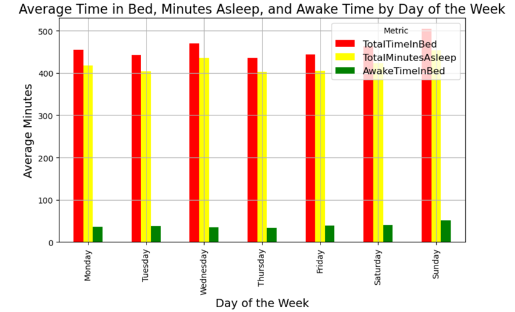

## 1. **Calories Burned per Hour**

- **Description**: This chart shows the average number of calories burned by users each hour. The highest calorie burn occurs between **5-7 PM**, with a noticeable rise starting at **6 AM** and peaking around **noon**.
- **Insight**: Bellabeat can leverage this by promoting morning workout challenges to users through the app and encouraging evening activities, which align with users' natural peaks in calorie burn.

## 2. **Calories Burned per Week**

- **Description**: A comparison of calories burned across different days of the week. The highest calorie burn happens on **Saturday**, with **Thursday** seeing the lowest.
- **Insight**: Weekend challenges in the Bellabeat app could be introduced to capitalize on the high calorie burn on Saturdays, while mid-week motivation (especially on Thursdays) could boost user engagement.

## 3. **Heart Rate per Hour**

- **Description**: This graph tracks the average heart rate per hour. The peak heart rate occurs at **6 PM**, with the lowest levels around **4 AM**.
- **Insight**: Bellabeat can integrate this information into the **Leaf** tracker and app to provide personalized recommendations for "Evening Heart Boost" workouts or "Nighttime Relax" sessions to help users manage stress.

## 4. **Heart Rate per Day**

- **Description**: This chart shows the average heart rate per day of the week. **Thursday** has the highest heart rate, suggesting increased activity or stress, while **Sunday** has the lowest.
- **Insight**: Bellabeat could offer stress management routines, especially on Thursdays, and promote relaxation techniques during weekends when users' heart rates are lower.

## 5. **Steps per Hour**

- **Description**: This chart illustrates the number of steps taken by users each hour. The most active time of day is **6 PM**, with a sharp decline after 7 PM.
- **Insight**: Bellabeat could introduce evening "Step Challenges" to encourage users to increase their step count during their most active periods.

## 6. **Steps per Weekday**

- **Description**: This bar chart shows users' activity across the days of the week. **Saturday** is the most active day, with **Sunday** being the least active.
- **Insight**: Bellabeat can encourage users to participate in weekend fitness challenges, such as the **Weekend Warrior** challenge, to boost activity levels.

## 7. **Minutes Spent in Each Activity**

- **Description**: This chart displays the average time spent in different activities per day. The majority of the time is spent sedentary, with very little time spent in high-intensity activities.
- **Insight**: Bellabeat should promote its app's "Move More" reminders to help users reduce sedentary time and offer "Intensity Boost" workouts for those looking to increase high-intensity activity.

## 8. **Weight Trends**

- **Description**: This chart shows fluctuations in user weight across various IDs. Users demonstrate consistent weight tracking, with fluctuations between 1-2 kg in some cases.
- **Insight**: Bellabeat can integrate weight management features in its app, offering personalized insights and trend analysis to help users monitor their progress and maintain healthy weight levels.

## 9. **Sleep per Day**

- **Description**: This chart shows average sleep duration and time spent in bed per day. **Sunday** is the day with the most sleep, while **Thursday** shows the least sleep.
- **Insight**: Bellabeat can provide sleep coaching on weekdays to improve sleep duration and efficiency, particularly on **Thursday** when users experience mid-week fatigue.

## 10. **Sleep Efficiency**

- **Description**: This chart demonstrates users' sleep efficiency by comparing time spent in bed to actual sleep. Higher efficiency is indicated by a line closer to 1, with variations suggesting inefficiency or oversleeping.
- **Insight**: Bellabeat can offer personalized sleep optimization tips based on sleep efficiency trends, helping users improve their rest quality.
